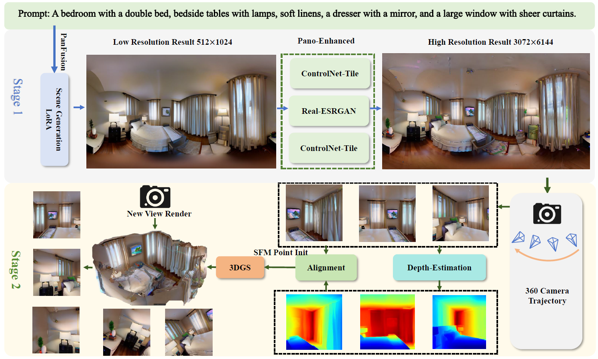
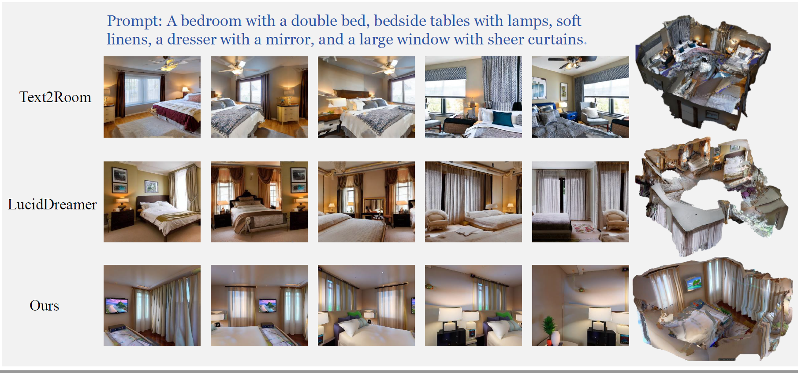
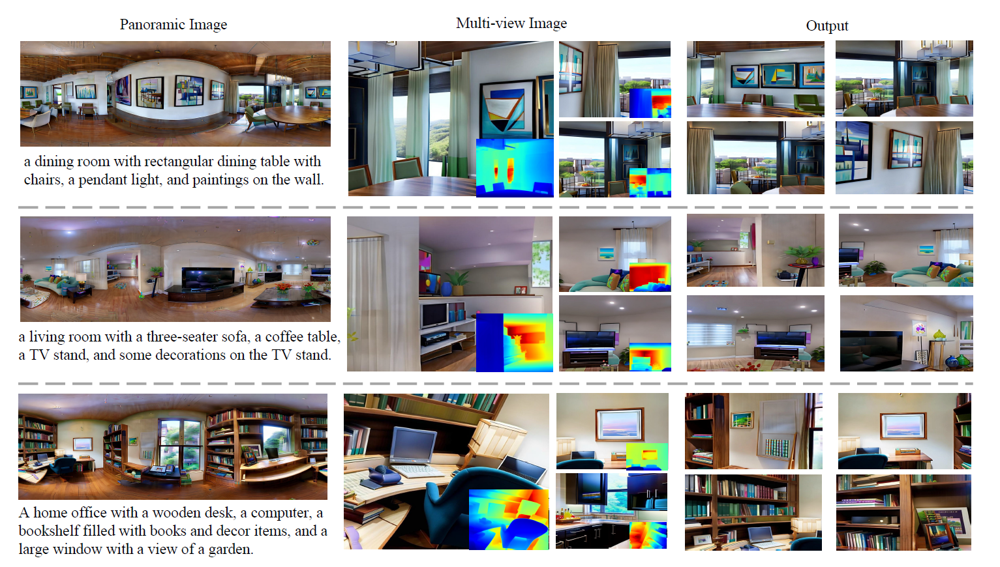

# SceneDreamer360: Text-Driven 3D-Consistent Scene Generation with Panoramic Gaussian Splatting

<div align="center">

[**Wenrui Li**](https://liwrui.github.io/),
[**Yapeng Mi**](https://github.com/miyapeng),
[**Fucheng Cai**](https://github.com/HITCai),
[**Zhe Yang**](https://github.com/xia-zhe),
[**Wangmeng Zuo**](https://scholar.google.com/citations?user=rUOpCEYAAAAJ),
[**Xingtao Wang**](https://homepage.hit.edu.cn/xtwang),
[**Xiaopeng Fan**](https://scholar.google.cz/citations?hl=zh-CN&user=4LsZhDgAAAAJ&view_op=list_works&sortby=pubdate)

[\[🌐 Project Page\]](https://scenedreamer360.github.io/) [\[📜 Paper\]](https://arxiv.org/abs/2408.13711)
</div>


[](https://arxiv.org/abs/5811784)



## Introduction
SceneDreamer360 leverages a text-driven panoramic image generation model as a prior for 3D scene generation and employs 3D Gaussian Splatting (3DGS) to ensure consistency across multi-view panoramic images. Specifically, SceneDreamer360 enhances the fine-tuned Panfusion generator with a three-stage panoramic enhancement, enabling the generation of high-resolution, detail-rich panoramic images. During the 3D scene construction, a novel point cloud fusion initialization method is used, producing higher quality and spatially consistent point clouds. Our extensive experiments demonstrate that compared to other methods, SceneDreamer360 with its panoramic image generation and 3DGS can produce higher quality, spatially consistent, and visually appealing 3D scenes from any text prompt.

## Visualization



## Environment Setup
Follow these steps to set up the required environment:
```shell
conda env create -f environment_strict.yaml
conda activate scenedreamer360

pip install -r Enhance_img/requirements.txt

cd PanoSpaceDreamer/submodules/depth-diff-gaussian-rasterization-min
python setup.py install
cd ../simple-knn
python setup.py install
cd ../../..
```

## Checkpoints
Download [PanFusion checkpoints](https://monashuni-my.sharepoint.com/:u:/g/personal/cheng_zhang_monash_edu/EeTrujeSOgdHh7vWsjXuMPAB8JtTaXS1uR8sp0y1kwQ4NQ?e=cI5jec) and move to `logs/4142dlo4/checkpoints`.
Also, download the panoramic optimization model from [Baidu Cloud](https://pan.baidu.com/s/1i_ypdWHknp2kqbjl0_zAuw?pwd=w2vr), and extract models.zip into `Enhance_img/`.

## Running
Modify the parameters in the `config.json` file to suit your test cases.

Update the text field to point to the prompt file you wish to test.
`campath_gen`(default: fullscan) supports the following options: fullscan, layerscan, lowerscan, rotate360, lookaround, moveright, moveback, arc, lockdown, hemisphere.
`campath_render`(default: 1440) supports the following options: 1440, 360, rotate360, headbanging, llff, back_and_forth.
To run the test, use this command:
```shell
WANDB_MODE=offline WANDB_RUN_ID=4142dlo4 python main.py predict --data=Matterport3D --model=PanFusion --ckpt_path=last
```

## Batch Processing
For batch testing, list the test prompts in the `data/prompt.txt` file (one prompt per line), and update the file name in the `data/Matterport3D/mp3d_skybox/e9zR4mvMWw7/blip3_stitched` directory to `test.txt`.

Run the following command to start batch processing:
```shell
python run.py
```

## Results
The results of the runs will be saved in the `logs/4142dlo4/predict` directory.


